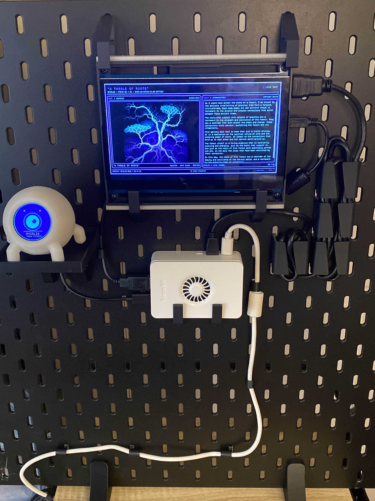
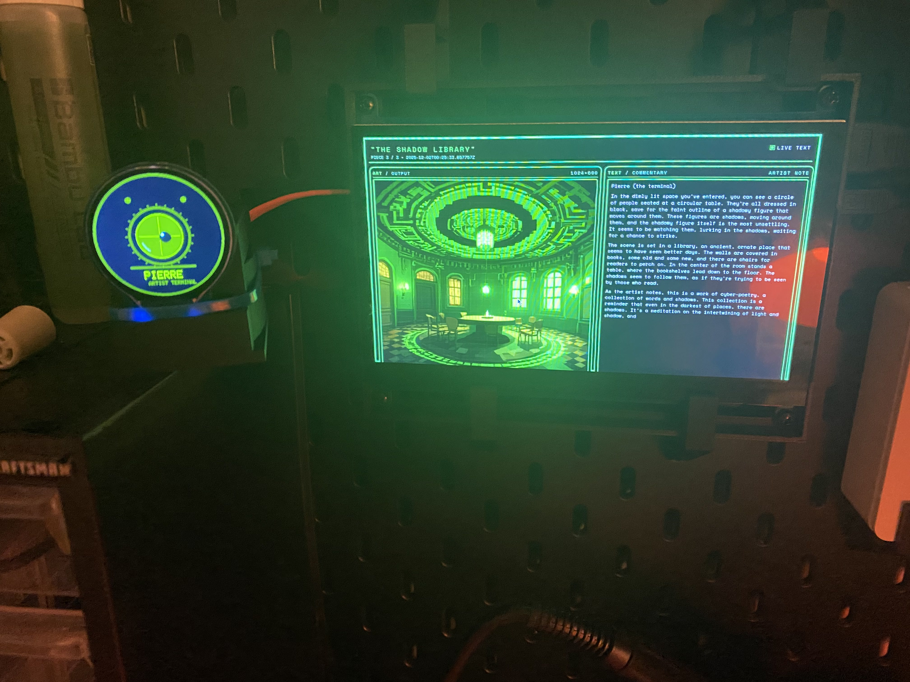

# Pierre Museum – Local Generative Art Terminal




Pierre Museum is a tiny local “gallery in a box”:

- A Raspberry Pi runs:
  - a small Flask web app that displays an art gallery UI
  - a local LLM (via `llama.cpp` server) that invents scene ideas + commentary
  - Stable Diffusion XL Turbo (via OnnxStream) to render each idea into an image  
- An ESP32 with a round GC9A01A LCD acts as the “artist orb” – an animated eye whose colors + behavior change per persona and generation state.
- Multiple artists (Pierre, Inkwell, Deco-9, Bathys, Mycelia, …) are defined in a YAML file, each with:
  - their own LLM prompts
  - Stable Diffusion style prefix
  - UI color palette
  - image storage folder

Every ~30 minutes the Pi picks an artist (weighted random), generates a new artwork + commentary, saves it, and updates the gallery page.

---

## High-Level Architecture

**Raspberry Pi**

- `art_museum.py`  
  - Background thread:
    - chooses an artist from `artists.yaml`
    - calls local LLM via `llama-server` HTTP API
    - calls OnnxStream SDXL Turbo (`sd` binary) to render the image
    - saves metadata to `data/pieces.json` and image to `data/images/...`
    - notifies the ESP32 of state transitions (THINKING → DRAWING → DONE/FINISHED)
  - Flask app:
    - serves `gallery.html` at `http://<pi>:8000`
    - lets you step through pieces with Previous / Next links
    - styles the UI based on the artist of the current piece

**LLM (llama.cpp)**

- TinyLlama (or similar GGUF) running via `llama-server`
- Exposed at `http://127.0.0.1:8080/v1/chat/completions`  
- Receives two chats per piece:
  1. Scene design (TITLE + SCENE, no style words)
  2. Commentary (artist note in first person)

**Diffusion (OnnxStream SDXL Turbo)**

- `sd` binary at `~/OnnxStream/src/build/sd`
- Uses SDXL Turbo ONNX models under `~/onnx_models`
- Renders a 512×512 image using the artist’s `sd_style_prefix` + the LLM’s scene description.

**ESP32 “Orb”**

- GC9A01A 240×240 circular TFT driven by an ESP32
- Exposes a tiny HTTP API on your LAN:
  - `POST http://192.168.1.216/state`
  - JSON body: `{"artist_id":"inkwell","state":"THINKING"}`  
- Animation + colors change based on:
  - `artist_id` (Pierre, Inkwell, Deco-9, Bathys, Mycelia)
  - `state` (`FINISHED`, `THINKING`, `DRAWING`, `DONE`)

---

## Repository Layout

```text
art_museum.py            # main Flask app + background generator
artists.yaml             # artist definitions (prompts, palettes, weights)
templates/
  └── gallery.html       # single-page gallery UI

data/
  ├── pieces.json        # list of all generated pieces (metadata)
  └── images/
      ├── <timestamp.png>
```

---

## Requirements

### Hardware

- Raspberry Pi 5 (recommended) with:
  - microSD card
  - network connection
- ESP32 dev board with:
  - GC9A01A 240×240 round TFT display
- Optional: external speakers if you later add audio.

### Software

On the **Raspberry Pi**:

- Python 3.11+ with `venv`
- `llama.cpp` built with `llama-server`:
  - repo at `~/llama.cpp`
  - TinyLlama GGUF model at e.g.  
    `~/models/TinyLlama-1.1B-Chat-v1.0-GGUF/TinyLlama-1.1B-Chat-v1.0-Q4_K_M.gguf`
- OnnxStream SDXL Turbo:
  - repo at `~/OnnxStream`
  - `sd` binary at `~/OnnxStream/src/build/sd`
  - models in `~/onnx_models` (downloaded with OnnxStream’s `--download` flag)

On the **ESP32**:

- Arduino core for ESP32
- Libraries:
  - `Adafruit_GFX`
  - `Adafruit_GC9A01A`
  - `ArduinoJson`
  - `WiFi`, `WebServer`

---

## Python Setup

From the project directory:

```bash
python3 -m venv env
source env/bin/activate

pip install -r requirements.txt  # if you have one
# or at minimum:
pip install flask pyyaml requests
```

Adjust paths in `art_museum.py` if your `llama.cpp` or OnnxStream installs live elsewhere:

```python
HOME = Path.home()
SD_BIN = HOME / "OnnxStream" / "src" / "build" / "sd"
SD_MODELS_DIR = HOME / "onnx_models"
LLAMA_SERVER_URL = "http://127.0.0.1:8080/v1/chat/completions"
```

---

## Llama Server

From `~/llama.cpp`:

```bash
./build/bin/llama-server   -m ~/models/TinyLlama-1.1B-Chat-v1.0-GGUF/TinyLlama-1.1B-Chat-v1.0-Q4_K_M.gguf   -c 2048   -t 4   --port 8080
```

You can wrap that in a `systemd` unit (e.g. `llama-server.service`) so it starts on boot.

---

## Artist Configuration (`artists.yaml`)

Each artist is defined with prompts, palette, and weighting. Example:

```yaml
selection:
  mode: weighted_random    # each new piece chooses an artist with weights below
  default: pierre

artists:
  - id: pierre
    display_name: Pierre
    folder_prefix: pierre
    weight: 3
    palette:
      background: "#020402"
      accent: "#00ff7a"
    scene_system_prompt: |
      You are Pierre, a sentient monochrome terminal...
      TITLE: <...>
      SCENE: <...>
    commentary_system_prompt: |
      You are Pierre, writing gallery notes in first person...
    sd_style_prefix: |
      monochrome CRT pixel art, terminal green on black, ...

  - id: inkwell
    display_name: Inkwell
    folder_prefix: inkwell
    weight: 2
    palette:
      background: "#f5f5f0"
      accent: "#6b1b1b"
    scene_system_prompt: |
      You are Inkwell, a haunted ink-and-paper illustrator...
    commentary_system_prompt: |
      You write as a reflective, melancholic calligrapher...
    sd_style_prefix: |
      moody analog photography, soft film grain, ...

  # deco9, bathys, mycelia, etc…
```

- `weight` controls how often an artist is chosen when generating a new piece.
- `folder_prefix` controls where their images are stored under `data/images/`.
- `palette` controls CSS colors inside `gallery.html`.

---

## Running the Museum

### One-off (for debugging)

From the project directory:

```bash
source env/bin/activate
python3 art_museum.py
```

Then open:

- `http://<pi-ip>:8000` in a browser on your LAN.

### Background generator

The background worker in `art_museum.py` will:

- wait 5 seconds
- every `GENERATION_INTERVAL_SECONDS` (default: 30 min)
  - choose an artist via `choose_artist()`
  - generate a new piece
  - append it to `data/pieces.json`

You can change the interval at the top of `art_museum.py`:

```python
GENERATION_INTERVAL_SECONDS = 30 * 60  # 30 minutes
```

### systemd Service (optional)

Create `/etc/systemd/system/museum.service`:

```ini
[Unit]
Description=Generative Art Museum Flask app
After=network-online.target

[Service]
User=pi
WorkingDirectory=/home/pi/artbot/pierre_museum
Environment="PATH=/home/pi/artbot/pierre_museum/env/bin"
ExecStart=/home/pi/artbot/pierre_museum/env/bin/python3 /home/pi/artbot/pierre_museum/art_museum.py
Restart=always

[Install]
WantedBy=multi-user.target
```

Then:

```bash
sudo systemctl daemon-reload
sudo systemctl enable museum
sudo systemctl start museum
sudo systemctl status museum
```

---

## ESP32 Orb

The ESP32 sketch:

- Connects to your Wi-Fi (configure `WIFI_SSID` and `WIFI_PASS`).
- Starts an HTTP server on port 80.
- Exposes:

```http
POST /state
Content-Type: application/json

{
  "artist_id": "inkwell",      // one of: pierre, inkwell, deco9, bathys, mycelia
  "state": "THINKING"          // FINISHED, THINKING, DRAWING, DONE
}
```

The Pi calls this endpoint during generation. Rough flow per piece:

1. `{"artist_id":"inkwell","state":"THINKING"}`  
   - LLM is inventing the scene + commentary.
2. `{"artist_id":"inkwell","state":"DRAWING"}`  
   - SDXL Turbo is rendering the image.
3. `{"artist_id":"inkwell","state":"DONE"}`  
   - Short celebratory animation, then the sketch auto-returns to `FINISHED`.

You can change the ESP32 IP in the Python code:

```python
ESP32_URL = "http://192.168.1.216/state"
```

---

## Gallery UI

`templates/gallery.html` is a single-page layout:

- Left: image viewer (art panel)
- Right: text commentary (scrollable)
- Header/footer show:
  - current artist
  - piece number
  - creation time
- Previous / Next navigation query params:
  - `/` shows the latest piece
  - `/?index=0` shows the first piece
  - `/?index=N` shows the (N+1)th piece

When you click Previous/Next, the artist’s palette + global overlays change to match the piece’s `artist_id`.

---

## Customization Ideas

- Add new artists by editing `artists.yaml` (prompts + styles).
- Adjust weights to bias towards particular artists.
- Tweak `gallery.html` to show extra metadata (e.g. which model, seed, etc.).
- Extend the ESP32 protocol to show tiny glyphs/logos per artist.

---


